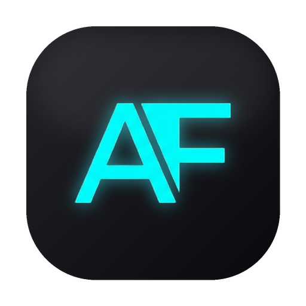

<p align="center">
  
</p>

<h1 align="center">FastAF</h1>

<p align="center"><b>The AI-agent IDE that doesn't eat your RAM.</b></p>

<p align="center">
  Native Rust + Tauri. <b>~300&nbsp;MB idle</b> — not the 2–3&nbsp;GB an Electron editor burns just sitting there.
</p>

<p align="center">
  <a href="https://github.com/ksg98/fastaf/releases/latest"><b>⬇ Download for macOS</b></a> ·
  <a href="#-why-fastaf">Why FastAF</a> ·
  <a href="#highlights">Features</a>
</p>

<p align="center">
  
  
  
</p>

---

## ⚡ Why FastAF?

Modern AI editors are Electron apps wearing a trench coat — every window is a full Chromium, so an editor like **Cursor** can sit at **2–3 GB of RAM while completely idle**, and the fans spin up before you've typed a thing.

**FastAF is built in Rust on Tauri.** There's no bundled browser. It uses your OS's native webview for the UI and a tiny Rust core for everything that matters — PTYs, Git, the filesystem, agent hooks. The result:

| | FastAF | Typical Electron AI editor |
|---|---|---|
| **Idle memory** | **~300 MB** | **2–3 GB** |
| **Engine** | Native Rust + OS webview | Bundled Chromium per window |
| **Install size** | ~10 MB DMG | Hundreds of MB |
| **Cold start** | Instant | Spin up a browser first |

Same agent-driven workflow. **A tenth of the footprint, and it's *fast af*.**

> Figures are approximate idle measurements and vary by OS, project size, and number of open sessions — but the order-of-magnitude gap is the whole point.

## What is FastAF?

FastAF is a fast, native desktop workspace for driving AI coding agents (**Claude Code**, **Codex**) and plain shells side by side. It runs many sessions across many projects, tracks each session's status — *working / waiting on you / done* — through lightweight terminal hooks, and pairs that with a built-in file explorer, code/diff viewer, and Git integration. All in a small Rust + Tauri shell instead of a heavy Electron app.

### Highlights

- **Plain or agent terminals** — open a bare `$SHELL` by default, or launch an agent (Claude Code / Codex) on demand.
- **Split terminal view** — toggle the dock between a single pane and a multi-pane grid, and open terminals in any of your projects.
- **Unified project sidebar** — projects as collapsible groups with their nested sessions, status dots, and diff badges.
- **Agent status + notifications** — terminal hooks surface when an agent is asking a question vs. finished, with a desktop notification and sound.
- **Native Git** — diff viewer, branch/worktree support, and clone-from-URL when adding a project.
- **VS Code-style UX** — command palette (⌘⇧P), quick-open (⌘P), file/in-file search (⌘⇧F), zoom (⌘ +/-/0), and a toggleable files panel (⌘B).
- **Drag &amp; drop** — drag a file from the tree into a terminal or the agent prompt.

## Download

Grab the latest build from the [**Releases**](https://github.com/ksg98/fastaf/releases/latest) page:

- **macOS** — `FastAF_*_aarch64.dmg` (Apple Silicon) or `FastAF_*_x64.dmg` (Intel)
- **Windows** — `.msi` / `.exe`
- **Linux** — `.deb` / `.rpm`

> macOS builds are currently unsigned — on first launch, right-click the app → **Open** to get past Gatekeeper.

## Tech stack

- **Frontend:** React 19 + TypeScript + Vite, xterm.js (terminal), Shiki (syntax highlighting)
- **Backend / shell:** Tauri 2 + Rust (PTYs, Git, filesystem, hooks)

## Development

Requires Node.js, pnpm (or npm), and the Rust toolchain.

```bash
pnpm install            # install frontend deps
pnpm tauri dev          # run the desktop app in dev mode (builds Rust + serves Vite)
pnpm tauri build        # produce a release bundle
```

Useful checks:

```bash
pnpm test               # vitest
pnpm lint               # eslint
cargo test --manifest-path src-tauri/Cargo.toml
```

## License & attribution

FastAF is licensed under [GPL-3.0](LICENSE).

FastAF is a modified version of the open-source project **NeZha**
(https://github.com/hanshuaikang/nezha) by Hanshuaikang and contributors, also
distributed under the GPL-3.0. See [NOTICE.md](NOTICE.md) for the full
attribution and modification notice.
